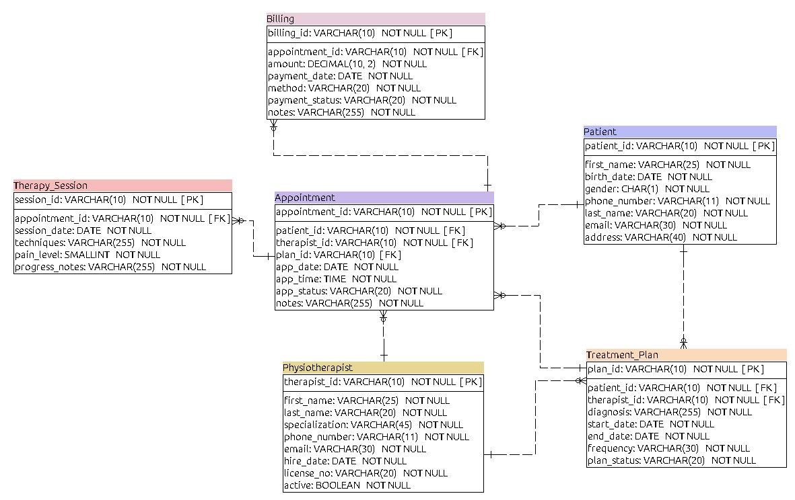

PhysioCare DB - Digital Flow Management System


## Tabla de Contenidos

- [Descripción General](#descripción-general)
- [Características Principales](#características-principales)
- [Tecnologías Utilizadas](#tecnologías-utilizadas)
- [Arquitectura del Sistema](#arquitectura-del-sistema)
- [Estructura de la Base de Datos](#estructura-de-la-base-de-datos)
- [API Endpoints](#api-endpoints)
- [Demostración en Vivo](#demostración-en-vivo)


## Descripción General

**PhysioCare DB** es un sistema integral de gestión digital para clínicas de fisioterapia, diseñado para reemplazar los métodos manuales tradicionales por una solución moderna, centralizada y eficiente.

### Problema que Resuelve

Actualmente, muchas clínicas pequeñas y medianas enfrentan problemas como:
- Pérdida de información clínica
- Conflictos de horarios en citas
- Dificultad para realizar seguimiento clínico
- Procesos administrativos lentos
- Información dispersa sin centralizar

### Nuestra Solución

PhysioCare DB ofrece:
- **Gestión centralizada** de pacientes, terapeutas y citas
- **Calendario interactivo** para administración de horarios
- **Seguimiento clínico** con planes de tratamiento y sesiones
- **Control financiero** mediante módulo de facturación
- **Interfaz responsive** adaptable a cualquier dispositivo

---

## Características Principales

###  Gestión de Pacientes
- Registro completo de información personal y contacto
- Historial médico centralizado
- Visualización de citas pasadas y futuras

### Gestión de Citas
- Calendario interactivo por día
- Filtrado por fechas y horarios
- Diferenciación visual entre:
  - Citas independientes
  - Citas pertenecientes a planes de tratamiento
- Bloqueo de horarios para descansos o reuniones
- Gestión flexible de horarios disponibles

### Planes de Tratamiento
- Creación de planes personalizados por paciente
- Generación **automática de citas** basada en frecuencia:
  - 1 vez por semana
  - 2 veces por semana
  - 3 veces por semana
  - Diario
  - Semanal
  - Quincenal
- Previsualización de citas antes de generar
- Regeneración automática al modificar fechas

### Sesiones Terapéuticas
- Documentación detallada de cada sesión
- Registro de técnicas utilizadas
- Escala de dolor (1-10)
- Notas de progreso clínico

### Facturación
- Registro de pagos por cita
- Múltiples métodos de pago
- Estados de pago (Pagado, Pendiente, Parcial, Vencido)
- Auto-generación desde citas completadas

### Reportes y Estadísticas
- Citas por terapeuta
- Historial médico por paciente
- Análisis de dolor promedio
- Totales de facturación

---

## Tecnologías Utilizadas

### Frontend
| Tecnología | Versión | Propósito |
|------------|---------|------------|
| React | 18.3.1 | Biblioteca principal de UI |
| TypeScript | 5.0.0 | Tipado estático |
| Tailwind CSS | 3.3.0 | Estilos y diseño responsive |
| Lucide React | 0.263.0 | Iconografía |
| Vite | 5.0.0 | Build tool |

### Backend
| Tecnología | Versión | Propósito |
|------------|---------|------------|
| Flask | 2.3.0 | Framework web Python |
| Flask-SQLAlchemy | 3.0.0 | ORM para base de datos |
| Flask-Marshmallow | 0.14.0 | Serialización de datos |
| Flask-CORS | 4.0.0 | Manejo de CORS |

### Base de Datos
| Tecnología | Versión | Propósito |
|------------|---------|------------|
| MySQL | 8.0 | Base de datos relacional |

---


## Estructura de la Base de Datos

### Diagrama Entidad-Relación


```

### Relaciones del Modelo Conceptual

| # | Relación | Cardinalidad | Descripción |
|---|----------|--------------|-------------|
| 1 | Patient → Appointment | 1:N | Un paciente puede tener muchas citas |
| 2 | Physiotherapist → Appointment | 1:N | Un terapeuta realiza muchas citas |
| 3 | Patient → Treatment_Plan | 1:N | Un paciente puede tener múltiples planes |
| 4 | Physiotherapist → Treatment_Plan | 1:N | Un terapeuta supervisa muchos planes |
| 5 | Appointment → Therapy_Session | 1:1 | Cada cita genera una sesión |
| 6 | Treatment_Plan → Appointment | 1:N | Un plan programa muchas citas |
| 7 | Appointment → Billing | 1:1 | Cada cita tiene una factura |


##  API Endpoints

### Pacientes
| Método | Endpoint | Descripción |
|--------|----------|-------------|
| GET | `/patients` | Obtener todos los pacientes |
| POST | `/patient` | Crear nuevo paciente |
| PUT | `/patient/{id}` | Actualizar paciente |
| DELETE | `/patient/{id}` | Eliminar paciente |

### Terapeutas
| Método | Endpoint | Descripción |
|--------|----------|-------------|
| GET | `/physiotherapists` | Obtener todos los terapeutas |
| POST | `/physiotherapist` | Crear nuevo terapeuta |
| PUT | `/physiotherapist/{id}` | Actualizar terapeuta |
| DELETE | `/physiotherapist/{id}` | Eliminar terapeuta |

### Planes de Tratamiento
| Método | Endpoint | Descripción |
|--------|----------|-------------|
| GET | `/treatment_plans` | Obtener todos los planes |
| GET | `/treatment_plans/patient/{id}` | Planes por paciente |
| POST | `/treatment_plans` | Crear plan (genera citas) |
| PUT | `/treatment_plans/{id}` | Actualizar plan |
| DELETE | `/treatment_plans/{id}` | Eliminar plan |
| POST | `/treatment_plans/{id}/regenerate-appointments` | Regenerar citas |
| GET | `/treatment_plans/{id}/preview-appointments` | Previsualizar citas |

### Citas
| Método | Endpoint | Descripción |
|--------|----------|-------------|
| GET | `/appointments` | Obtener todas las citas |
| GET | `/appointments/patient/{id}` | Citas por paciente |
| GET | `/appointments/plan/{id}` | Citas por plan |
| POST | `/appointment` | Crear cita |
| PUT | `/appointment/{id}` | Actualizar cita |
| DELETE | `/appointment/{id}` | Eliminar cita |

### Sesiones Terapéuticas
| Método | Endpoint | Descripción |
|--------|----------|-------------|
| GET | `/therapy_sessions` | Obtener todas las sesiones |
| POST | `/therapy_session` | Crear sesión |
| PUT | `/therapy_session/{id}` | Actualizar sesión |
| DELETE | `/therapy_session/{id}` | Eliminar sesión |

### Facturación
| Método | Endpoint | Descripción |
|--------|----------|-------------|
| GET | `/billings` | Obtener todas las facturas |
| GET | `/billings/patient/{id}` | Facturas por paciente |
| POST | `/billing` | Crear factura |
| PUT | `/billing/{id}` | Actualizar factura |
| DELETE | `/billing/{id}` | Eliminar factura |

### Reportes
| Método | Endpoint | Descripción |
|--------|----------|-------------|
| GET | `/reports/appointments_by_therapist` | Citas por terapeuta |
| GET | `/reports/appointments` | Reporte general |
| GET | `/medical_history/patient/{id}` | Historia médica |

---

## Demostración en Vivo

### Ejemplo de Uso: Crear un Plan de Tratamiento

```bash
# 1. Crear un plan de tratamiento
curl -X POST http://127.0.0.1:5000/treatment_plans \
-H "Content-Type: application/json" \
-d '{
    "patient_id": 1,
    "therapist_id": 3,
    "diagnosis": "Lower back pain",
    "start_date": "2026-05-20",
    "end_date": "2026-06-20",
    "frequency": "2 times/week",
    "plan_status": "Active"
}'

# Respuesta incluye generación automática de citas:
{
    "plan_id": 5,
    "appointments_generated": {
        "status": "success",
        "message": "Successfully generated 8 appointments",
        "count": 8,
        "failed": 0,
        "total_dates": 8
    }
}

# 2. Verificar citas generadas
curl http://127.0.0.1:5000/appointments/plan/5

# 3. Registrar una sesión terapéutica
curl -X POST http://127.0.0.1:5000/therapy_session \
-H "Content-Type: application/json" \
-d '{
    "appointment_id": 15,
    "session_date": "2026-05-20",
    "techniques": "Massage therapy and stretching",
    "pain_level": 3,
    "progress_notes": "Patient shows good improvement"
}'

# 4. Registrar pago
curl -X POST http://127.0.0.1:5000/billing \
-H "Content-Type: application/json" \
-d '{
    "appointment_id": 15,
    "amount": "50.00",
    "payment_date": "2026-05-20",
    "method": "Card",
    "payment_status": "Paid",
    "notes": "Payment completed"
}'
```

---

